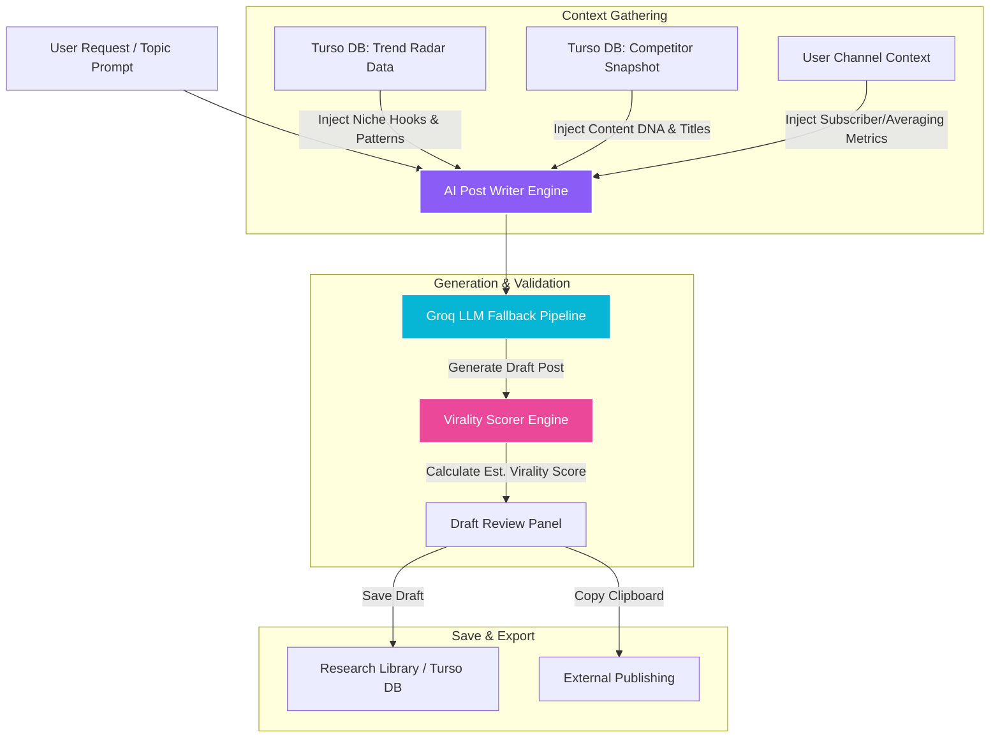

# Svay Intelligence: AI Post Writer (Feature Specification)

This document details the design, architecture, and feature specifications for the **AI Post Writer**, a tool built to generate viral-optimized social posts, video scripts, and newsletter copy using Svay's real-time creator analytics and competitor intelligence.

---

## 1. Feature Overview

The **AI Post Writer** is not a generic AI text generator. Instead of writing in a vacuum, it connects directly to Svay's **Trend Radar** and **Competitor Matrix** data pipelines. This allows the AI to craft content that replicates the exact psychological hooks, vocabulary, and formatting structures currently succeeding in the creator's niche.

### Core Value Proposition
* **Trend-Informed Writing:** Infuses hot topics discovered by the daily indexing snapshot.
* **Competitor DNA Mirroring:** Adapts tone, structure, and pacing based on high-efficiency rival videos.
* **Virality Pre-Scoring:** Grades draft copy using Svay's proprietary ranking engine (`@/lib/ranking/virality.js`) before publication.
* **Seamless Workspace Integration:** Syncs generated posts directly into the creator's **Research Notes Library**.

---

## 2. Architecture & Data Flow

Below is the workflow showing how the AI Post Writer pulls context from the database caches to feed the AI generator and output drafts.



---

## 3. Key Capabilities

### A. Dynamic Format Selection
The tool supports multiple templates specifically optimized for different platforms:
1. **YouTube Community Posts:** Visual-centric text updates designed to drive engagement and polls.
2. **Video Descriptions & Metadata:** SEO-friendly descriptions embedded with keywords, chapters, and timestamps.
3. **X / Twitter Threads:** Highly hook-driven, bite-sized threads structured for maximum retweets.
4. **LinkedIn Outlines:** Professional storytelling formats structured for reach and industry authority.
5. **Short-Form Scripts (Shorts/Reels/TikTok):** 30-60 second fast-paced verbal scripts featuring direct hook, body, and call-to-action indicators.

### B. "DNA Mirror" Competitor Modeling
* The writer analyzes competitor channels in the same niche.
* It extracts common vocabulary lists, sentence lengths, and formatting elements (e.g., short paragraphs, bullet points, emoji usage density).
* The LLM applies these stylistic parameters as system rules during generation.

### C. Live Hook Injection
* Pours trending titles and psychological hooks discovered by the **Trend Radar** database cache directly into the generation context.
* Guides the creator to choose from 3 alternative "Scroll-Stopping Hooks" for the beginning of each post.

---

## 4. Technical Specifications

### API Endpoint: `/api/writer/generate` (Proposed)
* **Method:** `POST`
* **Access:** Restricted to Pro subscribers (gates verified by `RouteGater`).
* **Request Payload Schema:**
```json
{
  "prompt": "How database sharding works for indie hackers",
  "format": "twitter-thread", // community-post | script | linkedin | description
  "tone": "educational",       // provocative | casual | authoritative
  "competitorDNA": true,      // enable competitor pattern matching
  "trendRadarContext": true   // inject trending keywords
}
```

* **Response Payload Schema:**
```json
{
  "success": true,
  "data": {
    "title": "Database Sharding 101",
    "content": "🧵 [Thread Draft Content...]",
    "hooksAlternative": [
      "Alternative hook 1",
      "Alternative hook 2"
    ],
    "estimatedViralityScore": 84,
    "matchingTrends": ["scaling-db", "indie-infrastructure"]
  }
}
```

### Database Integration (Turso DB schema addition)
To save generated drafts under the user's Library context, we will expand the `Library` schema to support the `post-writer` item type:

```sql
ALTER TABLE library_items ADD COLUMN source_tool TEXT DEFAULT 'manual';
-- 'manual' (standard notes) or 'post-writer' (AI generated drafts)
```

---

## 5. Development Roadmap

1. **Phase 1 (Interface Design):** Build the sidebar menu item and responsive generation interface in the Web workspace.
2. **Phase 2 (Context Processor):** Write the query helpers to load active Trend Radars and competitor snapshot details.
3. **Phase 3 (Groq Integration):** Setup the fallback LLM pipeline in `/api/writer/generate`.
4. **Phase 4 (Scoring System):** Connect output strings to the virality prediction model for live pre-scores.
5. **Phase 5 (Sync Pipeline):** Implement the "Save to Library" button to sync with the Research Notes database.
